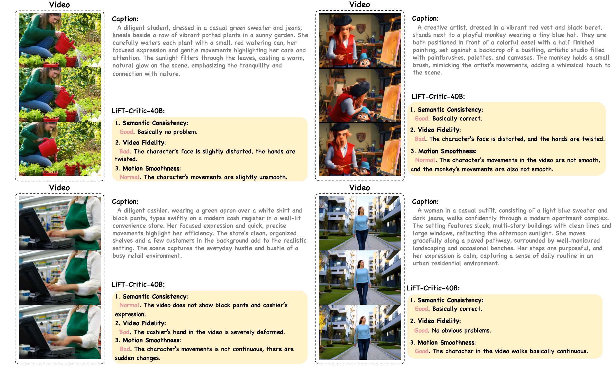

<div align="center">

<h1>LiFT: Leveraging Human Feedback for Text-to-Video Model Alignment</h1>

[Yibin Wang](https://codegoat24.github.io), [Zhiyu Tan](https://scholar.google.com/citations?user=XprTQQ8AAAAJ&hl=en), [Junyan Wang](https://scholar.google.com/citations?hl=en&user=5yS_tTUAAAAJ), Xiaomeng Yang, [Cheng Jin](https://cjinfdu.github.io/)&#8224;, [Hao Li](https://scholar.google.com/citations?user=pHN-QIwAAAAJ&hl=en)&#8224; 


[Fudan University]

[Shanghai Academy of Artificial Intelligence for Science]

[Australian Institute for Machine Learning, The University of Adelaide]

(&#8224;corresponding author)


<a href="https://arxiv.org/pdf/2412.04814">
</a>
<a href="https://codegoat24.github.io/LiFT/">
</a>

[](https://huggingface.co/collections/Fudan-FUXI/lift-critic-6756e628d83c390221e02857)
[](https://huggingface.co/collections/Fudan-FUXI/lift-hra-6760f063b04baaf6350c9d2e)

</div>

## 🔥 News
- [2024/12/25] 🔥 We released the supplementary of our [paper](https://arxiv.org/pdf/2412.04814).
- [2024/12/24] 🔥🔥 We have updated our [**LiFT-HRA**](https://huggingface.co/collections/Fudan-FUXI/lift-hra-6760f063b04baaf6350c9d2e) 10K/20K dataset and [**LiFT-Critic-v1.5**](https://huggingface.co/collections/Fudan-FUXI/lift-critic-6756e628d83c390221e02857). Welcome to download the latest version !!
- [2024/12/20] 🔥 The supplementary of our [paper](https://arxiv.org/pdf/2412.04814) will be updated on arXiv soon.
- [2024/12/17] 🔥 We released our optimized evaluation prompts derived from [VBench](https://github.com/Vchitect/VBench) in `Vbench/Vbench_full_info_opt.json` for users to reproduce the results in our [paper](https://arxiv.org/pdf/2412.04814).
- [2024/12/17] 🔥🔥 We released our [**LiFT-HRA**](https://huggingface.co/collections/Fudan-FUXI/lift-hra-6760f063b04baaf6350c9d2e) dataset 10K/20K and the enhanced version [**LiFT-Critic-v1.5**](https://huggingface.co/collections/Fudan-FUXI/lift-critic-6756e628d83c390221e02857) !!
- [2024/12/16] 🔥 Our **LiFT-HRA** dataset 10K/20K and the enhanced version **LiFT-Critic-v1.5** is coming soon!!
- [2024/12/10] 🔥🔥 We released the training and inference code.
- [2024/12/9] 🔥 We released the [**LiFT-Critic-v1.0**](https://huggingface.co/collections/Fudan-FUXI/lift-critic-6756e628d83c390221e02857)  and [**CogVideoX-2B-LiFT**](https://huggingface.co/collections/Fudan-FUXI/lift-critic-6756e628d83c390221e02857). Our code is coming soon!!
- [2024/12/9] 🔥 We released the [paper](https://arxiv.org/pdf/2412.04814).
- [2024/12/6] 🔥 We launched the [project page](https://codegoat24.github.io/LiFT/).

## 📖 Abstract

<p>
Recent advancements in text-to-video (T2V) generative models have shown impressive capabilities. However, these models are still inadequate in aligning synthesized videos with human preferences (e.g., accurately reflecting text descriptions), which is particularly difficult to address, as human preferences are inherently subjective and challenging to formalize as objective functions. Therefore, this paper proposes LiFT, a novel fine-tuning method leveraging human feedback for T2V model alignment. Specifically, we first construct a Human Rating Annotation dataset, LiFT-HRA, which includes approximately 10k human annotations comprising both a score and the corresponding rationale. 
Based on this, we train a reward model LiFT-Critic to learn human feedback-based reward function effectively, which serves as a proxy for human judgment, measuring the alignment between given videos and human expectations.
Lastly, we leverage the learned reward function to align the T2V model by maximizing the reward-weighted likelihood. 
As a case study, we apply our pipeline to CogVideoX-2B, showing that the fine-tuned model outperforms the CogVideoX-5B across all 16 metrics, highlighting the potential of human feedback in improving the alignment and quality of synthesized videos.
</p>


## 🔧 Installation

1. Clone this repository and navigate to LiFT folder
```bash
git clone https://github.com/CodeGoat24/LiFT.git
cd LiFT
```
2. Install packages
```
bash ./environment_setup.sh lift
```

## 🚀 Inference
### LiFT-Critic-13b/40b-lora Weights
Please download all public LiFT-Critic checkpoints from [Huggingface](https://huggingface.co/collections/Fudan-FUXI/lift-critic-6756e628d83c390221e02857). 

### Run
We provide some synthesized videos for quick inference in `./demo` directory.

LiFT-Critic-13b:
```bash
python LiFT-Critic/test/run_critic_13b.py --model-path ./LiFT-Critic-13b-lora
```

LiFT-Critic-40b:
```bash
python LiFT-Critic/test/run_critic_40b.py --model-path ./LiFT-Critic-40b-lora
```
### Examples



## 💻 Training
LiFT-Critic is trained on 8 H100 GPUs with 80GB memory.

### LiFT-Critic Dataset
Please download our [**LiFT-HRA**](https://huggingface.co/collections/Fudan-FUXI/lift-hra-6760f063b04baaf6350c9d2e) dataset and the 1K subset of the [VIDGEN-1M](https://huggingface.co/datasets/Fudan-FUXI/VIDGEN-1M) (derived from [HD-VILA](https://huggingface.co/datasets/TempoFunk/hdvila-100M)) we used in our [paper](https://arxiv.org/pdf/2412.04814).

Please put them under `./dataset` directory. The data structure is like this:
```
dataset
├── LiFT-HRA
│  ├── LiFT-HRA-data.json
│  ├── videos
├── VIDGEN
│  ├── vidgen-data.json
│  ├── videos
```

### LiFT-Critic Training
LiFT-Critic-13b
```bash
bash LiFT_Critic/train/train_critic_13b.sh
```
LiFT-Critic-40b
```bash
bash LiFT_Critic/train/train_critic_40b.sh
```

### CogVideo Dataset
1. Run CogVideoX to generate videos based on your prompts and save the generated videos in the `./CogVideo/dataset/videos/` directory.
2. Use LiFT-Critic to score each generated video.
3. Obtain reward score for each video
```bash
python ./CogVideo/process_reward_score.py
```
Please put the output file under `./CogVideo/dataset` directory. The data structure is like this:
```
dataset
├── videos/
├── data.json
```
### Reward Learning
```bash
cd CogVideo
bash finetune/train.sh
```

## 🗓️ TODO
- ✅ Release project page
- ✅ Release paper
- ✅ Release LiFT-Critic 13B/40B-v1.0
- ✅ Release CogVideoX-2B-LiFT
- ✅ Release inference code
- ✅ Release training code
- ✅ Release LiFT-Critic 13B/40B-v1.5
- ✅ Release dataset LiFT-HRA 10K
- ✅ Release dataset LiFT-HRA 20K
- ✅ Release CogVideoX reward learning code
- [ ] Release CogVideoX-5B-LiFT
- [ ] Release LiFT-Critic 13B/40B-v2.0

## 📧 Contact

If you have any comments or questions, please open a new issue or feel free to contact [Yibin Wang](https://codegoat24.github.io).

## 🖊️ Citation
🌟 If you find our work helpful, please leave us a star and cite our paper.

```bibtex
@article{LiFT,
  title={LiFT: Leveraging Human Feedback for Text-to-Video Model Alignment.},
  author={Wang, Yibin and Tan, Zhiyu, and Wang, Junyan and Yang, Xiaomeng and Jin, Cheng and Li, Hao},
  journal={arXiv preprint arXiv:2412.04814},
  year={2024}
}
```

## 🖼️ Results
<table border="0" style="width: 100%; text-align: left; margin-top: 20px;">
  <tr>
      <td>
            <h2>CogVideoX-2B</h2>
          <video src="https://github.com/user-attachments/assets/6e05e678-88ad-499a-b31f-66679746f7b7" width="100%" controls autoplay loop></video>
      </td>
      <td>
            <h2>CogVideoX-2B-LiFT(Ours)</h2>
          <video src="https://github.com/user-attachments/assets/e45af501-8d89-4db0-8e4c-3a1e1b0e948b" width="100%" controls autoplay loop></video>
      </td>
  </tr>
    <tr>
      <td>
          <video src="https://github.com/user-attachments/assets/a5a35d67-3ce1-415a-a7f4-c2e982b3b318" width="100%" controls autoplay loop></video>
      </td>
      <td>
          <video src="https://github.com/user-attachments/assets/aea1c0ff-cc1c-476a-8c0e-7c4a34ed404d" width="100%" controls autoplay loop></video>
      </td>
  </tr>
    <tr>
      <td>
          <video src="https://github.com/user-attachments/assets/8818d282-09e2-47df-9f50-92c6281c7da7" width="100%" controls autoplay loop></video>
      </td>
      <td>
          <video src="https://github.com/user-attachments/assets/df1c487a-3a60-4ee2-b8ef-98fafed9bb09" width="100%" controls autoplay loop></video>
      </td>
  </tr>
    <tr>
      <td>
          <video src="https://github.com/user-attachments/assets/59874ca4-d3df-4e76-a1bc-909f5d3424c5" width="100%" controls autoplay loop></video>
      </td>
      <td>
          <video src="https://github.com/user-attachments/assets/f7ced2e8-7e68-4549-91b7-164d54a7bad3" width="100%" controls autoplay loop></video>
      </td>
  </tr>
    <tr>
      <td>
          <video src="https://github.com/user-attachments/assets/c1930e74-b9e2-4df2-84a2-f51bcbf153fe" width="100%" controls autoplay loop></video>
      </td>
      <td>
          <video src="https://github.com/user-attachments/assets/5d310ea7-ba24-4e83-8701-e2bb4217837d" width="100%" controls autoplay loop></video>
      </td>
  </tr>
    <tr>
      <td>
          <video src="https://github.com/user-attachments/assets/b426c98a-6816-4fe1-aabf-cf9444262761" width="100%" controls autoplay loop></video>
      </td>
      <td>
          <video src="https://github.com/user-attachments/assets/81ea3a02-979f-43a4-97ca-445f3414b51f" width="100%" controls autoplay loop></video>
      </td>
  </tr>
      <tr>
      <td>
          <video src="https://github.com/user-attachments/assets/b51b211f-20ea-4895-b117-a147bc7f63a8" width="100%" controls autoplay loop></video>
      </td>
      <td>
          <video src="https://github.com/user-attachments/assets/54e52501-087b-4127-9a3c-fd481c990820" width="100%" controls autoplay loop></video>
      </td>
  </tr>
</table>


# 🙏 Acknowledgement
Our work is based on [LLaVA](https://github.com/haotian-liu/LLaVA) and [VILA](https://github.com/NVlabs/VILA), thanks to all the contributors!
